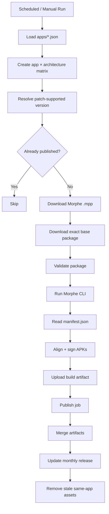

# Morphe Auto Build

[](https://github.com/Fahry-a/Farhan-Morphe-Auto-Build/actions/workflows/build.yml)
[](https://github.com/Fahry-a/Farhan-Morphe-Auto-Build/actions/workflows/tests.yml)
[](https://github.com/Fahry-a/Farhan-Morphe-Auto-Build)

**Morphe Auto Build** is a GitHub Actions pipeline for automatically downloading, patching, signing, and publishing Morphe-modified Android APKs.

> **Describe an app in `apps/<id>.json`, and let the pipeline handle the rest.**

It currently builds **Google Photos** and **Brave**, including Brave **ARM64** and **ARM32 / armeabi-v7a** packages.

---

## ✨ Features

- 🤖 Daily automated builds at **09:00 WIB**.
- 🧩 **Config-driven apps** — add an app without duplicating the workflow.
- 🏗️ Multi-architecture matrix builds.
- 📦 APK, APKM, and XAPK source support.
- 🔎 Patch-aware version resolution instead of blindly using the newest APK.
- 🌐 APKMirror, GitHub Releases, and direct mirror download backends.
- 🛡️ Download validation before patching.
- 🧾 Manifest-driven signing and publishing.
- 🔐 APK signing with a GitHub Actions secret keystore.
- 📅 Monthly GitHub Releases with stale same-app assets pruned.
- ♻️ Idempotent builds — already-published builds are skipped.
- 🧪 Unit tests for important Python components.
- 🔒 GitHub Actions pinned to commit SHAs.
- 📦 Python dependencies pinned and maintained with Dependabot.
- ⚡ Playwright/Chromium cache for faster APKMirror fallback runs.

---

## 📱 Supported apps

| App | Package | Patch source | Base source | Architectures | Flavors |
| --- | --- | --- | --- | --- | --- |
| **Google Photos** | `com.google.android.apps.photos` | `Akash-Sriram/morphe-google-photos` | APKMirror | Universal | `mod`, `original` |
| **Brave** | `com.brave.browser` | `kveld9/kveld-morphe-patches` | GitHub | ARM64, ARM32 | Default |

### Brave architectures

| Architecture | Asset |
| --- | --- |
| ARM64 / `arm64-v8a` | `BraveMonoarm64.apk` |
| ARM32 / `armeabi-v7a` | `BraveMonoarm.apk` |

> The selected APK version follows the version supported by the Morphe patch. The pipeline does **not** blindly build the newest upstream APK.

---

## 🔄 How the pipeline works



### 1. Configuration

Every enabled application lives under `apps/`:

```text
apps/
├── brave.json
└── google-photos.json
```

The workflow reads these files and turns their architecture definitions into a build matrix.

### 2. Version resolution

`tools/resolve_version.py`:

1. Reads the version of the prebuilt Morphe `.mpp`.
2. Loads the matching `patches-list.json`.
3. Filters targets by Android package name.
4. Excludes experimental targets unless `allow_experimental: true`.
5. Selects the highest supported stable target.

This keeps the base APK and patch definition aligned.

### 3. Existing-build check

Before expensive downloads and patching, the current monthly release is checked.

If all expected assets already exist, that matrix entry is skipped.

Use `rebuild=true` for a manual rebuild.

### 4. Download

The pipeline downloads both the patch bundle and the exact base package.

**APKMirror**

`tools/apkmirror.py` uses:

- `curl_cffi` as the fast path.
- Chrome impersonation for normal requests.
- Playwright + headless Chromium when a Cloudflare JavaScript challenge requires a browser.

**GitHub**

`tools/github_source.py` resolves the actual release asset URL through the GitHub API.

**Direct**

A direct mirror can be configured when the normal store/source is unavailable.

### 5. Validation

Every download is checked before patching.

- APKs must be readable by `aapt`.
- The detected version must match the requested version.
- APK bundles must contain APK entries.
- Invalid or malformed downloads fail early.

The goal is to turn a bad download into a clear validation error instead of a confusing patcher error.

### 6. Patching

`tools/patch.py` invokes the Morphe Desktop CLI.

The resulting files are recorded in `manifest.json`.

The manifest is then used by signing/publishing so the pipeline works from **actual generated files**, rather than guessing filenames.

### 7. Signing

Generated APKs go through:

1. `zipalign`
2. required ZIP/repack handling
3. `apksigner`

The signing key comes from GitHub Actions secrets and is never committed to the repository.

### 8. Publishing

The `publish` job collects the successful matrix artifacts and updates one monthly release:

```text
2026-09
2026-10
2026-11
...
```

A release contains the latest successful build for each configured app/architecture.

When an app receives a newer build, stale assets for that same app are removed while other apps' release sections are preserved.

---

## 📦 Release layout

Example:

```text
Release: 2026-09

Google Photos
├── google-photos-universal-v7.92.0.977185651-mod.apk
└── google-photos-universal-v7.92.0.977185651-original.apk

Brave
├── brave-arm64-v1.95.104.apk
└── brave-arm32-v1.95.104.apk
```

Release tags use the month:

```text
YYYY-MM
```

Old versions of the same app are pruned from that monthly release instead of accumulating indefinitely.

---

## 🗂️ Repository structure

```text
.
├── .github/
│   ├── CODEOWNERS
│   ├── dependabot.yml
│   └── workflows/
│       ├── build.yml
│       └── tests.yml
│
├── apps/
│   ├── brave.json
│   └── google-photos.json
│
├── tests/
│   ├── test_common.py
│   ├── test_monthly_release.py
│   └── test_resolve_version.py
│
├── tools/
│   ├── apkmirror.py
│   ├── common.py
│   ├── github_source.py
│   ├── monthly_release.py
│   ├── patch.py
│   └── resolve_version.py
│
├── requirements.txt
└── README.md
```

| Path | Purpose |
| --- | --- |
| `.github/workflows/build.yml` | Main build, sign, and publish pipeline |
| `.github/workflows/tests.yml` | Unit-test workflow |
| `.github/dependabot.yml` | Weekly dependency update configuration |
| `apps/*.json` | Application/build configuration |
| `tools/resolve_version.py` | Patch-supported version resolver |
| `tools/apkmirror.py` | APKMirror downloader |
| `tools/github_source.py` | GitHub asset downloader |
| `tools/patch.py` | Morphe patching + manifest generation |
| `tools/monthly_release.py` | Monthly release management |
| `tools/common.py` | Shared helpers and validation |
| `tests/` | Regression/unit tests |

---

## 🕐 Automatic builds

The scheduled workflow runs once per day:

```text
02:00 UTC
   ↓
09:00 WIB
```

Cron:

```cron
0 2 * * *
```

Normal scheduled runs only build entries that actually need updating.

---

## 🎛️ Manual builds

The workflow supports `workflow_dispatch`.

| Input | Purpose |
| --- | --- |
| `app` | One app or all enabled apps |
| `arch` | One architecture or all configured architectures |
| `version_override` | Force a specific app version |
| `direct_apk_url` | Use a specific APK URL |
| `allow_experimental` | Allow experimental patch targets |
| `rebuild` | Rebuild even if assets already exist |

### Input safety rules

- `version_override` requires a **single app**.
- `direct_apk_url` requires a **single app + single architecture**.

These checks prevent ambiguous matrix builds.

---

## ➕ Adding another app

The workflow is intentionally configuration-driven.

Create:

```text
apps/<id>.json
```

Normally you do **not** need to copy or modify `build.yml`.

An app configuration describes:

- Android package name
- patch repository
- source type
- architectures
- patch bundle
- flavors
- experimental-target policy

### GitHub source example

```json
{
  "id": "brave",
  "display_name": "Brave Browser",
  "package": "com.brave.browser",
  "patch_repo": "kveld9/kveld-morphe-patches",
  "allow_experimental": false,
  "source": {
    "type": "github",
    "repo": "brave/brave-browser",
    "tag_prefix": "v",
    "file_type": "apk",
    "archs": [
      {
        "name": "arm64",
        "asset": "BraveMonoarm64.apk"
      },
      {
        "name": "arm32",
        "asset": "BraveMonoarm.apk"
      }
    ]
  },
  "patch_bundle": {
    "type": "prebuilt"
  },
  "flavors": [
    {
      "name": "default",
      "patch_include": [],
      "output_suffix": ""
    }
  ]
}
```

### APKMirror source example

```json
{
  "source": {
    "type": "apkmirror",
    "file_type": "apkm",
    "archs": [
      {
        "name": "universal",
        "variant_url": "https://www.apkmirror.com/apk/...",
        "slug_filter": "/apk/.../",
        "version_slug": "some-app-"
      }
    ]
  }
}
```

### Direct mirror example

Direct URLs can use `{version}` and `{package}` placeholders:

```json
{
  "source": {
    "type": "direct",
    "file_type": "xapk",
    "archs": [
      {
        "name": "universal",
        "url": "https://example.invalid/releases/{version}/{package}-{version}.xapk"
      }
    ]
  }
}
```

### Temporarily disable an app

Keep its configuration but remove it from the matrix:

```json
"enabled": false
```

This is useful when a source temporarily blocks CI or the patch needs maintenance.

---

## 💻 Local development

### Requirements

- Python 3.12+
- Java 21+
- Android build tools containing `aapt`, `zipalign`, and `apksigner`
- Chromium when the Playwright fallback is needed
- Morphe Desktop CLI `.jar` for patching

### Install dependencies

```bash
pip install -r requirements.txt
playwright install chromium --with-deps
```

### Resolve a version

```bash
python3 tools/resolve_version.py \
  --config apps/google-photos.json

python3 tools/resolve_version.py \
  --config apps/brave.json
```

### Download from APKMirror

```bash
python3 tools/apkmirror.py \
  --config apps/google-photos.json \
  --arch universal \
  --exact-version 7.92.0.977185651 \
  --output base.apk
```

### Download a GitHub asset

```bash
python3 tools/github_source.py \
  --config apps/brave.json \
  --arch arm64 \
  --apk-version 1.95.104 \
  --output base.apk
```

### Patch locally

```bash
python3 tools/patch.py \
  --config apps/brave.json \
  --arch arm64 \
  --cli morphe-cli.jar \
  --mpp patches.mpp \
  --base base.apk
```

---

## 🧪 Testing

Run all unit tests:

```bash
python -m unittest discover -s tests -v
```

Current tests cover important behavior including:

- architecture configuration parsing,
- APK/APKM validation,
- patch target selection,
- stable vs experimental target handling,
- release-note section replacement,
- stale asset detection.

The test workflow also runs on relevant pushes and pull requests.

---

## ♻️ Dependency updates

Dependabot is configured for:

- **GitHub Actions**
- **Python / pip dependencies**

Updates are checked weekly and grouped to reduce unnecessary PR noise.

Python dependencies remain pinned in `requirements.txt` so CI is deterministic while Dependabot can propose controlled upgrades.

GitHub Actions are pinned to commit SHAs rather than floating tags.

> Dependabot configuration becomes active for version updates once this configuration is present on the repository's default branch.

---

## ⚡ Playwright cache

APKMirror may require Playwright/Chromium when the fast HTTP path encounters a Cloudflare JavaScript challenge.

The workflow caches:

```text
~/.cache/ms-playwright
```

The cache is keyed from the Python dependency state, so changing the Playwright dependency naturally results in a new cache.

This avoids downloading Chromium from scratch on every eligible CI run.

---

## 🔒 CI security and reliability

The automation includes several hardening measures:

- Minimal `contents` permissions by default.
- Write permission only where publishing requires it.
- GitHub Actions pinned to commit SHAs.
- Signing keys stored only in Actions secrets.
- Downloaded packages validated before patching.
- Morphe CLI version pinned in CI.
- Concurrency prevents overlapping scheduled/manual runs from racing.
- CODEOWNERS keeps CI-sensitive files visible for review.
- Unit tests run separately from the production build.
- Existing releases are checked before expensive build work.

The objective is reproducible automation without turning every supported app into a separate workflow.

---

## 🧭 Design principles

### Configuration over duplication

Add an app configuration instead of cloning the workflow.

### Fail early

Reject malformed or unexpected downloads before patching.

### Deterministic inputs

The patch version and base application version should be explicitly resolved before the build starts.

### Manifest-driven outputs

Signing and publishing consume files actually produced by the patcher.

### Idempotent publishing

Repeating an unchanged build should not create duplicate release assets.

### Avoid unnecessary work

Already-published builds are skipped unless explicitly rebuilt.

---

## 📝 Notes

The original Google Photos-only prototype (`cuma-contoh.py`) was removed after the project was refactored into the modular `tools/` architecture.

For patch-specific behavior, see the corresponding Morphe patch repository. This project provides the automation layer around those patch definitions; it does not define the patches themselves.

---

## 📜 License

See [LICENSE](LICENSE) for licensing information.
