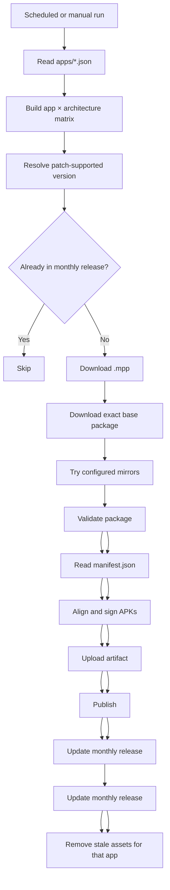

# Morphe Auto Build

[](https://github.com/Fahry-a/Farhan-Morphe-Auto-Build/actions/workflows/build.yml)
[](https://github.com/Fahry-a/Farhan-Morphe-Auto-Build/actions/workflows/tests.yml)
[](https://github.com/Fahry-a/Farhan-Morphe-Auto-Build)

GitHub Actions automation for building Morphe-patched Android APKs.

The repository currently builds:

- Google Photos through multiple APK mirrors
- Brave from GitHub releases
- Brave ARM64 (`arm64-v8a`)
- Brave ARM32 (`armeabi-v7a`)

The workflow is configuration-driven. Adding another application normally means adding `apps/<id>.json`, not copying the workflow.

## Supported applications

| Application | Package | Patch repository | Source | Architectures | Flavors |
| --- | --- | --- | --- | --- | --- |
| Google Photos | `com.google.android.apps.photos` | `Akash-Sriram/morphe-google-photos` | APKMirror → APKPure → Uptodown → Aptoide | Universal | `mod`, `original` |
| Brave | `com.brave.browser` | `kveld9/kveld-morphe-patches` | GitHub | ARM64, ARM32 | Default |

Brave assets:

| Architecture | Source asset |
| --- | --- |
| `arm64-v8a` | `BraveMonoarm64.apk` |
| `armeabi-v7a` | `BraveMonoarm.apk` |

The build version is selected from the versions supported by the Morphe patch. It does not simply use the newest APK available from the source.

## Pipeline



### Configuration

Each application is described by a file under `apps/`.

```text
apps/
├── brave.json
└── google-photos.json
```

The workflow reads the configured architectures and expands them into a GitHub Actions matrix.

### Version resolution

`tools/resolve_version.py` determines which application version can be built with the available patch:

1. Read the version of the prebuilt Morphe `.mpp`.
2. Load the matching `patches-list.json`.
3. Filter targets by Android package name.
4. Exclude experimental targets unless enabled.
5. Select the highest supported stable target.

This avoids pairing a patch with an unsupported application version.

### Existing release check

Before downloading and patching, the workflow checks the current monthly release.

If the expected assets already exist, that matrix entry is skipped. A manual run with `rebuild=true` can bypass this check.

### Download sources

The downloader is selected from `source.type` in the application configuration.

For `type: "mirrors"`, sources are tried in configuration order. The current Google Photos order is:

```text
APKMirror → APKPure → Uptodown → Aptoide
```

Each candidate is resolved for the requested exact version, downloaded to a temporary `.partial` file, validated, and only then moved into the final output path. A failed or invalid source is discarded and the next configured source is tried.

### APKMirror

`tools/apkmirror.py` uses `curl_cffi` normally and can fall back to Playwright when a browser-based Cloudflare challenge requires it.

### APKPure

The multi-source downloader resolves the requested version through APKPure's version/download pages and extracts the package download URL.

### Uptodown

The multi-source downloader generates candidate slugs, searches version pages for the requested version, and extracts the package download URL.

### Aptoide

The multi-source downloader uses the Aptoide API to locate the requested package/version and obtains its download URL.

### GitHub

`tools/github_source.py` resolves the requested release asset through the GitHub API.

### Direct source

A direct URL can be configured when a package is available from a known URL.

#### APKMirror

`tools/apkmirror.py` uses `curl_cffi` as the normal path. If the site requires a browser-based Cloudflare challenge, it falls back to Playwright and headless Chromium.

APKMirror bundles are saved with their actual `.apkm` extension and validated before patching.

#### GitHub

`tools/github_source.py` resolves the requested release asset through the GitHub API and downloads the selected file.

#### Direct source

A direct URL can be configured when a required package is available from another mirror.

### Validation

Downloads are validated before they reach the patcher.

- APKs must be readable by `aapt`.
- The detected version must match the requested version.
- APK bundles must contain APK entries.
- Invalid or unexpected files stop the build before patching.

### Patching

`tools/patch.py` invokes the Morphe Desktop CLI.

The patcher output is recorded in `manifest.json`. Later stages consume that manifest instead of reconstructing output filenames from configuration.

### Signing

Generated APKs are processed with:

1. `zipalign`
2. ZIP/repack handling where required
3. `apksigner`

The signing keystore is supplied through GitHub Actions secrets and is not stored in the repository.

### Publishing

The `publish` job collects the successful build artifacts and updates one GitHub Release per month.

Release tags use:

```text
YYYY-MM
```

For example:

```text
2026-09
2026-10
2026-11
```

Each monthly release keeps the latest successful build for each configured app and architecture. When an app is rebuilt, older assets belonging to that app are removed while other apps in the release are preserved.

## Release example

```text
2026-09

Google Photos
├── google-photos-universal-v7.92.0.977185651-mod.apk
└── google-photos-universal-v7.92.0.977185651-original.apk

Brave
├── brave-arm64-v1.95.104.apk
└── brave-arm32-v1.95.104.apk
```

The exact output names are taken from the build manifest and application configuration.

## Scheduled builds

The workflow runs once per day:

```text
02:00 UTC
    ↓
09:00 WIB
```

Cron:

```cron
0 2 * * *
```

Scheduled runs skip application/architecture combinations that are already up to date.

## Manual builds

The workflow supports `workflow_dispatch`.

| Input | Description |
| --- | --- |
| `app` | Build one app or all enabled apps |
| `arch` | Build one architecture or all configured architectures |
| `version_override` | Override the resolved application version |
| `direct_apk_url` | Use a specific APK URL |
| `allow_experimental` | Allow experimental patch targets |
| `rebuild` | Rebuild even when the release already contains the expected assets |

There are two validation rules for manual runs:

- `version_override` requires a single app.
- `direct_apk_url` requires a single app and a single architecture.

## Repository layout

```text
.
├── .github/
│   ├── CODEOWNERS
│   ├── dependabot.yml
│   └── workflows/
│       ├── build.yml
│       └── tests.yml
├── apps/
│   ├── brave.json
│   └── google-photos.json
├── tests/
│   ├── test_common.py
│   ├── test_mirror_download.py
│   ├── test_monthly_release.py
│   └── test_resolve_version.py
├── tools/
│   ├── apkmirror.py
│   ├── common.py
│   ├── github_source.py
│   ├── mirror_download.py
│   ├── monthly_release.py
│   ├── patch.py
│   └── resolve_version.py
├── requirements.txt
└── README.md
```

| Path | Responsibility |
| --- | --- |
| `.github/workflows/build.yml` | Build, sign, and publish workflow |
| `.github/workflows/tests.yml` | Unit-test workflow |
| `.github/dependabot.yml` | Dependabot configuration |
| `apps/*.json` | Application definitions |
| `tools/resolve_version.py` | Patch-supported version selection |
| `tools/apkmirror.py` | APKMirror-specific downloader |
| `tools/mirror_download.py` | Multi-source mirror fallback |
| `tools/github_source.py` | GitHub asset downloads |
| `tools/patch.py` | Morphe patching and manifest generation |
| `tools/monthly_release.py` | Monthly release maintenance |
| `tools/common.py` | Shared configuration and validation helpers |
| `tests/` | Unit and regression tests |

## Adding an application

Create:

```text
apps/<id>.json
```

The workflow does not need to be copied or modified for a normal new application.

An application configuration defines:

- Android package name
- Morphe patch repository
- source type
- architectures
- patch bundle
- flavors
- experimental-target policy

### GitHub source

```json
{
  "id": "brave",
  "display_name": "Brave Browser",
  "package": "com.brave.browser",
  "patch_repo": "kveld9/kveld-morphe-patches",
  "allow_experimental": false,
  "source": {
    "type": "github",
    "repo": "brave/brave-browser",
    "tag_prefix": "v",
    "file_type": "apk",
    "archs": [
      {
        "name": "arm64",
        "asset": "BraveMonoarm64.apk"
      },
      {
        "name": "arm32",
        "asset": "BraveMonoarm.apk"
      }
    ]
  },
  "patch_bundle": {
    "type": "prebuilt"
  },
  "flavors": [
    {
      "name": "default",
      "patch_include": [],
      "output_suffix": ""
    }
  ]
}
```

### Multi-source mirror source

Use `type: "mirrors"` when the same exact application version may be obtained from more than one source.

```json
{
  "source": {
    "type": "mirrors",
    "file_type": "apk",
    "mirrors": [
      {"type": "apkmirror"},
      {"type": "apkpure", "name": "google-photos"},
      {"type": "uptodown", "name": "google-photos"},
      {"type": "aptoide"}
    ]
  }
}
```

The downloader receives `--exact-version` from the version resolver; mirror sources do not independently select the newest version.

### APKMirror source

```json
{
  "source": {
    "type": "apkmirror",
    "file_type": "apkm",
    "archs": [
      {
        "name": "universal",
        "variant_url": "https://www.apkmirror.com/apk/...",
        "slug_filter": "/apk/.../",
        "version_slug": "some-app-"
      }
    ]
  }
}
```

### Direct source

Direct URLs can use `{version}` and `{package}` placeholders.

```json
{
  "source": {
    "type": "direct",
    "file_type": "xapk",
    "archs": [
      {
        "name": "universal",
        "url": "https://example.invalid/releases/{version}/{package}-{version}.xapk"
      }
    ]
  }
}
```

Set `"enabled": false` to keep an application configuration without including it in the build matrix.

## Signing

The workflow expects these GitHub Actions secrets:

| Secret | Required | Default | Purpose |
| --- | --- | --- | --- |
| `KEYSTORE_BASE64` | Yes | — | Base64-encoded Android keystore |
| `KEYSTORE_PASSWORD` | No | `android` | Keystore password |
| `KEY_PASSWORD` | No | `android` | Private key password |
| `KEY_ALIAS` | No | — | Alias when needed |

Generate a keystore locally:

```bash
keytool -genkeypair -v \
  -keystore release.keystore \
  -alias morphe \
  -keyalg RSA \
  -keysize 2048 \
  -validity 10000 \
  -storepass 'PASS' \
  -keypass 'PASS' \
  -dname "CN=Morphe Auto Build, OU=CI, O=Personal, C=ID"

base64 -w0 release.keystore > keystore.b64
```

Do not commit either file.

Set the repository secrets:

```bash
gh secret set KEYSTORE_BASE64 < keystore.b64
gh secret set KEYSTORE_PASSWORD --body 'PASS'
gh secret set KEY_PASSWORD --body 'PASS'
gh secret set KEY_ALIAS --body 'morphe'
```

Verify a built APK:

```bash
apksigner verify --print-certs output.apk
```

## Local development

Requirements:

- Python 3.12+
- Java 21+
- Android build tools containing `aapt`, `zipalign`, and `apksigner`
- Chromium when the Playwright fallback is needed
- Morphe Desktop CLI `.jar`

Install Python dependencies:

```bash
pip install -r requirements.txt
playwright install chromium --with-deps
```

Resolve a supported version:

```bash
python3 tools/resolve_version.py \
  --config apps/google-photos.json

python3 tools/resolve_version.py \
  --config apps/brave.json
```

Download from APKMirror:

```bash
python3 tools/apkmirror.py \
  --config apps/google-photos.json \
  --arch universal \
  --exact-version 7.92.0.977185651 \
  --output base.apk
```

Download a GitHub asset:

```bash
python3 tools/github_source.py \
  --config apps/brave.json \
  --arch arm64 \
  --apk-version 1.95.104 \
  --output base.apk
```

Patch locally:

```bash
python3 tools/patch.py \
  --config apps/brave.json \
  --arch arm64 \
  --cli morphe-cli.jar \
  --mpp patches.mpp \
  --base base.apk
```

## Testing

Run the unit tests:

```bash
python -m unittest discover -s tests -v
```

The tests cover:

- architecture configuration parsing
- APK/APKM validation
- patch target selection
- stable and experimental target handling
- release-note section replacement
- stale asset detection
- multi-source Aptoide lookup and download handling

The test workflow also runs on relevant pushes and pull requests.

## Dependency maintenance

Dependabot is configured for:

- GitHub Actions
- Python dependencies

Updates are checked weekly and grouped to reduce unnecessary pull requests.

Python dependencies are pinned in `requirements.txt`, while Dependabot proposes version updates.

GitHub Actions are pinned to commit SHAs rather than floating version tags.

The Dependabot configuration needs to exist on the repository's default branch before GitHub uses it for normal version-update PRs.

## Playwright cache

The APKMirror downloader can fall back to Playwright when an HTTP request encounters a browser-based Cloudflare challenge.

The CI workflow caches:

```text
~/.cache/ms-playwright
```

The cache key includes the Python dependency state. Updating the Playwright dependency therefore creates a new cache instead of reusing browser binaries from an incompatible version.

## CI security and reliability

The workflow includes:

- read-only `contents` permissions by default
- write permission only for publishing
- commit-SHA-pinned GitHub Actions
- signing keys stored in Actions secrets
- package validation before patching
- a pinned Morphe CLI version
- workflow concurrency to prevent overlapping release jobs
- CODEOWNERS for CI-sensitive paths
- a separate unit-test workflow

The build also avoids unnecessary work by checking the current release before downloading and patching.

## Design principles

### Configuration over duplication

Applications are represented as data under `apps/` instead of separate workflows.

### Fail early

Bad or unexpected downloads are rejected before patching.

### Deterministic inputs

The patch version and application version are resolved explicitly before the build.

### Source resilience

A mirror failure does not necessarily stop the build. Configured fallback sources are tried in order, with exact-version and package validation applied to every candidate.

### Manifest-driven outputs

Signing and publishing operate on files recorded by the patcher.

### Idempotent publishing

Repeating an unchanged build should not create another copy of the same release assets.

### Keep expensive work conditional

If the release already contains the expected outputs, the download and patch stages are skipped.

## Notes

The original Google Photos-only prototype (`cuma-contoh.py`) was removed when the project was refactored into the modular `tools/` architecture.

This repository provides the automation layer around Morphe patch definitions. Patch behavior itself belongs to the corresponding patch repositories.

## License

See [LICENSE](LICENSE).
